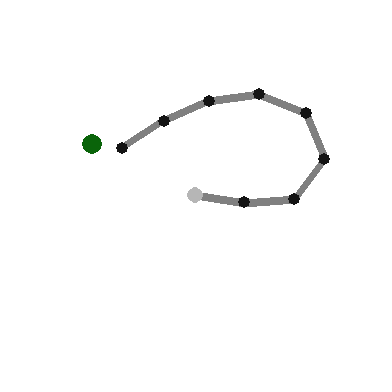
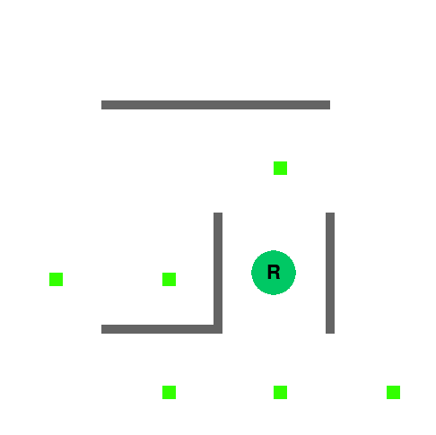
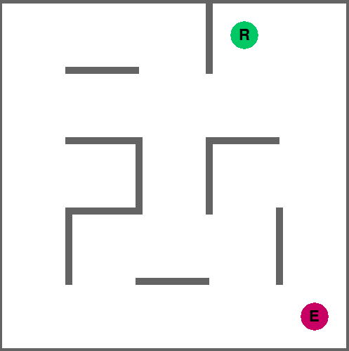

# Deep Reinforcement Learning Baseline Environments

Thesis project, implementing vairous gyms to test various Deep RL algorithms against as baselines.
Each environment is able to scale in complexity of either total state space size or the inherent difficulty of the problem.
To read more, read the associated thesis which uses Rllibs library within these environments:
https://github.com/kinseyreeves/Deep-RL-Baselines/blob/master/Masters_Thesis.pdf

#### The repo contains
- gym-scalable : the codebase of each environment using the openai gym structure
- Testing->env_testers : examples on running the environments without deeprl
- Testing->Experiments : examples of the experiments using rllib Tune
- Algorithms : some deep RL algorithms implemented in Pytorch.

Any questions email me:
kreeves@student.unimelb.edu.au

**Requirements**
- OpenAI gym
- Pygame
- RLLib if testing environments

**Installation** 

Checkout this repositiory.
In the top level of `gym-scalable` folder. 
Run `pip install -e .` to install the gym.

To run an environment:
```Python
import gym_scalable

env = gym.make('n-joints-v0',  config = {"extra_joints": 1, "extra_state": False})
```
With this, the environment can be run using Rays Rllib and Tune. See more on how to run custom Rllib environments using Tune:
https://docs.ray.io/en/latest/tune/index.html

The available environments : 
*A set of environments needs to be registered, todo.

# Environment configurations

Configurations are passed to the environments as `config` dictionaries. This is the format for RLLIB environments.
Each environment can be started using the gym. All environments are stored in the gym-scalable directory.
### N-jointed arm
- Environment consists of an arm of N-joints which must configure itself    to touch an objective

    - Action space : discrete (scalable) one hot, or continuous of number of free joints
    - State space array consists of:
        - At target 1|0
        - Joint position_x to objective position_x  (For all joints)
        - Joint position_y to objective position_y (For all joints)
        - distance x from centre to objective
        - distance y from centre to objective
        
    e.g. 2 joints will consist of array of size 7
### Config:
```python
config = {
    #number of joints the arm has
    "num_joints" : 3,
    #Full state information used for jacobian, basic state has just joint (x,y) positions
    "full_state" : False,
}

```
<p>
    
</p>
A 7 jointed reacher.

    
 ## Grid World
 - Grid-Evader
    - Action space : discrete
    - State space : discrete (grid coordinates of evader and chaser)
    
Overall config

```python
config = {
    # Whether or not to randomize the start position and goal / enemy positions
    "randomize_start" : False,
    "randomize_goal" : False,
    #If we want to use the full state encoding, or just positions of interest
    "state_encoding" : 'st',
    #Do we want to use 1 rewards where available, e.g. if false -0.1 rewards used, as outlined in Sutton 2018
    "capture_reward" : False,
    #whether we want to slowdown for testing purposes / when evaluating
    "slowdown_step" : False
}

```
There are 3 state encodings for the state_encoding parameter:
nw : 2d grid of positions encoded to integers (no walls)
w : 2d grid of positions encoded to integers (with walls)
st : 1 hot matrix, which is a conversion of a vector containing positions of interest, e.g. 

```
Python
[x_self, y_self, goal_1_x, goal_1_y, goal_2_x, goal_2_y]
```
The size of these can be found using gyms observation_space variables.

### Maze solver
    - Action space : discrete (scalable)
    - State space : discrete (grid coordinates of evader and chaser)
 
Goal is to pick up the rewards in as few steps as possible. Baseline is based on A* and then a brute force TSP implementation. 

<p>
    
    
</p>
A 4x4 maze. 


#### Config
`
#number of goals in the maze to pickup
config = {"mapfile": map_loader.get_size_map(3),
          "randomize_start": True,
          "randomize_goal": True, 
          "curriculum": False, #This should be set to false, as hinders performance, experimental
          "curriculum_eps": 5, #
          "num_goals": 6, #Number of goals in the env
          "capture_reward": False, #Reward the agent on capture
          "state_encoding": "st" #see below
          }
`

### Grid-Evader and Chaser
 
Goal is to evade the chaser as long as possible, follows the same. Follows the same config as the general grid world config.
To set it to be RL-controlled chaser or RL-controlld evader, change the RL_evader variable. RL_evader = True means RL controlling the evader.

<p>
    
    
</p>
An evader maze. 


